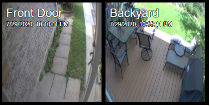

# MMM-BlinkCameraIntegration
Extension for the [MagicMirror](https://github.com/MichMich/MagicMirror). 
Interfaces with the Blink home security cameras, displays snapshots and latest videos.

**Notes:**
* This is dependent upon a required fix to the dependency- `node-blink-security`, as login fails due to a misallignment with the Blink API.
Please see my PR [here](https://github.com/madshall/node-blink-security/pull/56)
* While we wait for a fix in `node-blink-security`, you could also workaround the problem yourself, for now, by performing the following, **after the installation of the module**:
  * `nano ~/MagicMirror/modules/MMM-BlinkCameraIntegration/node_modules/node-blink-security/lib/blink.js`
  * Go to line #398 and change it to the following: `if (this.auth_2FA && (body.client || {}).verification_required) {`
  * Save and re-run your mirror

**Next to be added:** 

* Support periodic snapshots from the cameras
* Support configuration of cameras and hubs

## Screenshots



## Installation
````
cd ~/MagicMirror/modules
git clone https://github.com/eric-h-st/MMM-BlinkCameraIntegration.git
cd MMM-BlinkCameraIntegration
npm install
````

## Using the module

To use this module, add it to the modules array in the `config/config.js` file:
````javascript
modules: [
	{
		module: 'MMM-BlinkCameraIntegration',
		position: "middle_center", // recommended 
		config: {
			// See 'Configuration options' for more information.
		}
	}
]
````

## Configuration Options

The following properties can be configured:

<table width="100%">
	<!-- why, markdown... -->
	<thead>
		<tr>
			<th>Option</th>
			<th width="100%">Description</th>
		</tr>
	<thead>
	<tbody>
		<tr>
			<td><code>email</code></td>
      <td>Your email, used to login to your <b>Blink</b> account<br>
				<br><b>Possible values:</b> <code>email address string</code>
				<br><b>Default value:</b> <code>null</code> 
        <br><b>Note: REQUIRED<b>
			</td>
		</tr>
		<tr>
			<td><code>password</code></td>
      <td>Your password, used to login to your <b>Blink</b> account<br>
				<br><b>Possible values:</b> <code>string</code>
				<br><b>Default value:</b> <code>null</code>
        <br><b>Note: REQUIRED<b>
			</td>
		</tr>
		<tr>
			<td><code>deviceId</code></td>
      <td>Friendly name for your Hub.<br>
				<br><b>Possible values:</b> <code>string</code>
				<br><b>Default value:</b> <code>null</code> 
        <br><b>Note: REQUIRED<b>
			</td>
		</tr>
		<tr>
			<td><code>displaySnapshots</code></td>
      <td>Should camera snapshots be displayed?<br>
				<br><b>Possible values:</b> <code>boolean</code>
				<br><b>Default value:</b> <code>true</code>
			</td>
		</tr>
		<tr>
			<td><code>displayLatestVideoMode</code></td>
      <td>What should trigger displaying the newest motion video?<br>
				<br><b>Possible values:</b> <code>number</code>, as follows:
        <br>
	  <table>
        	<thead>
          <tr>
            <th>Value to use</th>
            <th>Name</th>
            <th width="100%">Description</th>
          </tr>
        	</thead>
	        <tbody>
             <tr>
               <td>0</td><td>NONE</td><td>Do not display motion videos, just emit the <code>BLINK_MOTION_VIDEO</code> notification</td>
             </tr>
             <tr>
               <td>1</td><td>IMMEDIATELY</td><td>Display the latest video once it arrives</td>
             </tr>
             <tr>
               <td>2</td><td>UPON_USERPRESENCE</td><td>Hold the latest video until <code>USER_PRESENCE</code> notification is deteced, to allow for the video to be displayed when the user is in front of the mirror</td>
             </tr>
        </table>        
	    <br><b>Default value:</b> <code>1</code>
	</td>
		</tr>
		<tr>
			<td><code>motionPollingIntervalInSeconds</code></td>
      <td>Interval, in seconds, to poll for new motion videos from <b>Blink</b><br>
				<br><b>Possible values:</b> <code>number > 15</code>
				<br><b>Default value:</b> <code>30</code>
			</td>
		</tr>
		<tr>
			<td><code>videoRepeats</code></td>
      <td>Number of times to loop the latest motion video before fading it out<br>
				<br><b>Possible values:</b> <code>positive number, or 0 to repeat until a new video is detected</code>
				<br><b>Default value:</b> <code>1</code>
			</td>
		</tr>
  </tbody>
</table>

## Developer Notes
This module broadcasts a `BLINK_MOTION_VIDEO` notification whenever a new motion video is detected, with the payload of the creation date and time of the video. You could use it to perform various actions, for example- to play a sound. 
<br>
<br>
This module listens to the `USER_PRESENCE` notification. 


## Dependencies
- [node-blink-security](https://www.npmjs.com/package/node-blink-security) (installed via `npm install`)

## The MIT License (MIT)
